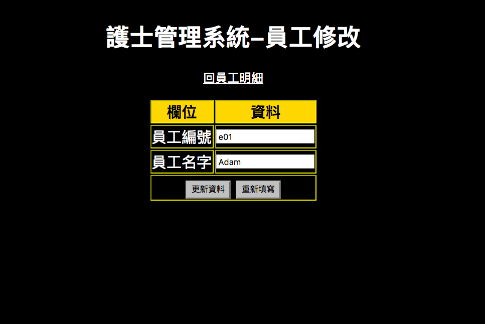
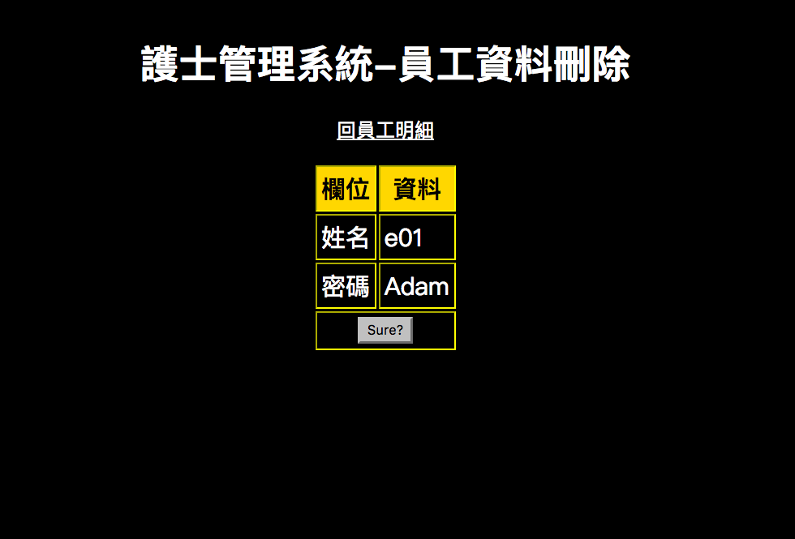
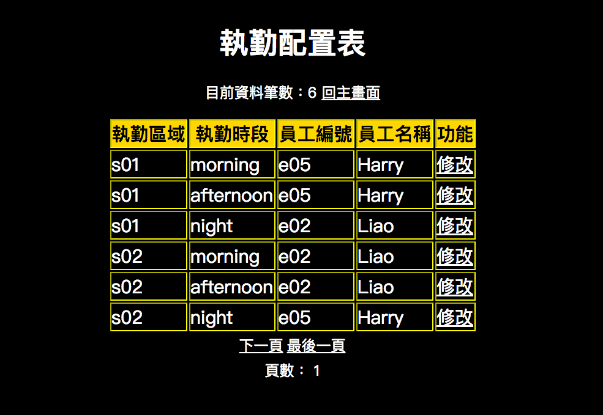
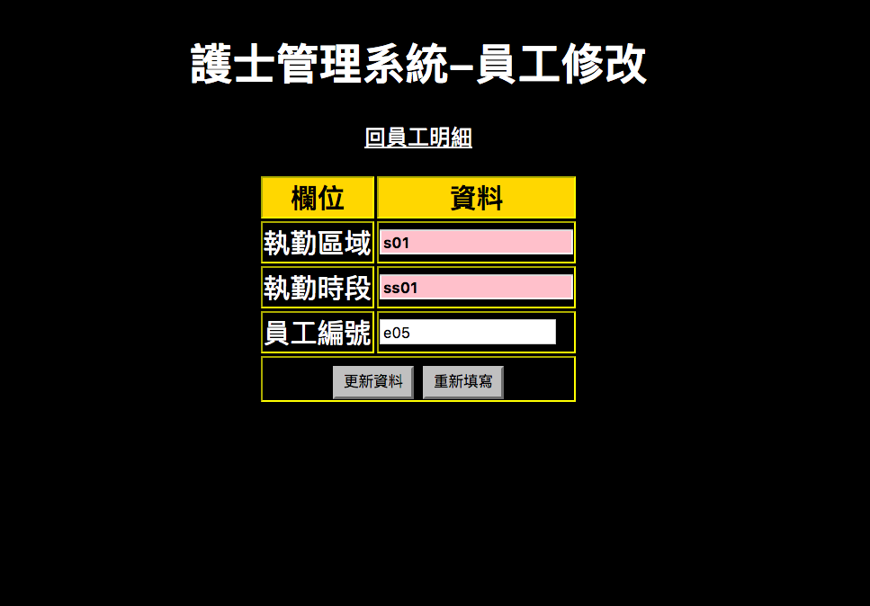

## 最後呈現

## 說明

### Table:

emp(員工明細)-empno(員工編號), ename(員工姓名)

site(工作區域)-siteno(區域編號), sname(區域名稱)

session(時段)-ssno(時段編號), ssname(時段名稱), timestart(起始時間), timeend(結束時間)

empsite(不同區域各時段員工配置表)-siteno, ssno, empno

### View:

schedule:siteno, sname, empno, ename, ssno, timestart, timeend

onduty:在schedule的基礎下多一層時間判定status(ps.也可以直接在schedule中就展現此欄位）

## 主畫面

## 員工明細

## 員工資料＿新增

## 員工資料＿修改

## 員工資料＿刪除

## 執勤配置明細

## 執勤區域所屬負責人員＿修改

